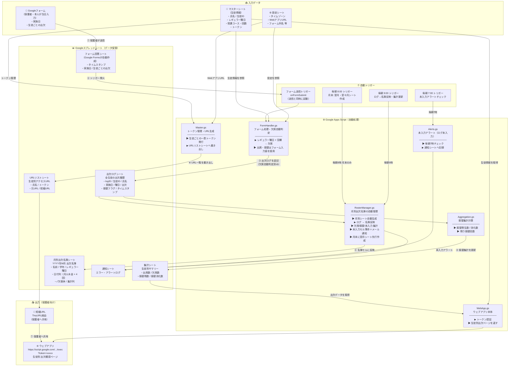

# 育成クラス 出欠管理システム 全体図

> 作成日: 2026/04/18

---

## システム概要図



---

## コンポーネント一覧

| カテゴリ | 名称 | 役割 |
|---|---|---|
| **入力** | Googleフォーム | 保護者・本人が当日の出欠を入力 |
| **入力** | マスターシート | 生徒の氏名・学年・レギュラー曜日・コース・トークンを管理 |
| **入力** | 設定シート | タイムゾーン・WebアプリURL・名簿自動作成開始日等の設定値 |
| **スクリプト** | FormHandler.gs | フォーム1行を読んで出欠ログへ書き込む。レギュラー曜日×空欄＝欠席を自動判定 |
| **スクリプト** | Aggregation.gs | 出欠ログから生徒別振替集計を計算・更新 |
| **スクリプト** | RosterManager.gs | 月別出欠名簿の自動生成・ログ反映・集計・未入力アラートを管理 |
| **スクリプト** | Master.gs | 生徒トークンの発行とURLリストの生成 |
| **スクリプト** | WebApp.gs | URLのトークンを検証して生徒別ページを返す |
| **スクリプト** | Alerts.gs | フォーム未入力があれば通知シートへ記録 |
| **データ** | フォーム回答シート | Google Formsが自動作成する回答データ |
| **データ** | 出欠ログシート | 全生徒・全日の出欠履歴（正規化済み・唯一の正データ） |
| **データ** | 集計シート | 生徒別の振替発生・消化・残数サマリー |
| **データ** | 月別出欠名簿シート | YYYY年M月 出欠名簿。表示専用。フロントスタッフが直接確認する名簿 |
| **データ** | URLリストシート | 生徒ごとの個別アクセスURL |
| **トリガー** | onFormSubmit | フォーム送信と同時に処理を起動 |
| **トリガー** | 毎朝7時 | フォーム未入力チェック・アラート送信 |
| **トリガー** | 毎朝8時 | 月末（25日以降）に翌月・翌々月の名簿シートを先行作成 |
| **トリガー** | 毎朝9時 | 名簿をログから再反映・集計更新 |
| **出力** | ウェブアプリ | 生徒別の出欠確認ページ（保護者がブラウザで閲覧） |
| **出力** | 短縮URL | TinyURL経由で保護者へ共有しやすい形に変換 |

---

## データフローの流れ（時系列）

```
① 授業当日（保護者が入力）
   Googleフォーム送信
        ↓
② 即時処理（onFormSubmit トリガー）
   FormHandler.js が起動
        ↓
③ 欠席自動判定
   レギュラー曜日の生徒が空欄 → 欠席として出欠ログに記録
   記入あり → フォームの入力値（出席/振替）を記録
        ↓
④ 集計更新
   出欠ログ → 集計シートをリアルタイム更新

⑤ 毎朝9時（自動バッチ）
   集計シートを再計算・最新化

⑥ 保護者が確認したいとき
   短縮URL をタップ → ウェブアプリ → 自分の子どもの出欠ページを閲覧
```

---

## 欠席自動判定ロジック

```
フォーム回答の対象日（実施日）の曜日を判定
        ↓
マスターシートから「その曜日がレギュラー」な生徒を抽出
        ↓
その生徒のフォーム回答列が…

  空白 → 欠席（ABSENT）として記録 ✅
  出席 → 出席（PRESENT）として記録
  振替 → 振替消化（MAKEUP）として記録

※ レギュラー曜日でない生徒は空白でも無視（対象外）
```

---

## 今後の運用メモ

| 作業 | 操作方法 |
|---|---|
| 毎日の出欠入力 | 保護者がGoogleフォームを送信するだけ（自動処理） |
| **月別名簿を初回作成したい** | メニュー「📋 月別出欠名簿」→「今月・来月の名簿シートを確認/作成」 |
| **名簿をすぐ最新にしたい** | メニュー「📋 月別出欠名簿」→「名簿をログから更新（全月）」 |
| **未入力セルを確認したい** | メニュー「📋 月別出欠名簿」→「未入力チェック・アラート（当月）」 |
| **名簿シートをやり直したい** | メニュー「📋 月別出欠名簿」→「今月の名簿シートを再作成」 |
| **名簿トリガーを有効にする** | メニュー「📋 月別出欠名簿」→「名簿トリガーを登録（毎日8時・9時）」 |
| 振替集計を今すぐ更新したい | メニュー「🔧 集計・デバッグ」→「振替集計を再計算（全員）」 |
| 生徒の曜日・コース・学年を変更 | マスターシートを直接編集 → 名簿シートを「再作成」で反映 |
| 生徒を追加 | マスターシートに1行追加（学年列も記入）→ URLリスト再出力 |
| 生徒のURLを再発行 | メニュー「⚙️ 初期設定・管理」→「短縮URLを一括生成」 |
| タイムゾーン確認 | ファイル→設定→「(GMT+09:00) Japan Standard Time」 |

---

## 月別出欠名簿 仕様まとめ

### シート名
`YYYY年M月 出欠名簿`（例: `2026年5月 出欠名簿`）

### レイアウト
| 行 | 内容 |
|---|---|
| 1行目 | タイトル（YYYY年M月 育成クラス出欠名簿） |
| 2行目 | 曜日ヘッダー（月・火・木・金…）＋集計ヘッダー |
| 3行目 | 日付（M/D 形式）＋集計列（空欄） |
| 4行目〜 | 生徒行 |

### 左側固定列（3列）
`名前 / 学年 / レギュラー曜日`

### 日付列ルール
- 月・火・木・金のみ表示
- 各曜日4回まで（5週目は除外）
- 左から時系列順

### 背景色
| 色 | 意味 |
|---|---|
| 白 | レギュラー日（入力対象） |
| グレー `#d9d9d9` | 非レギュラー日（入力不可） |
| 薄赤 `#ffd6d6` | 今日以前の未入力（要確認） |

### 出欠表示文字
| ステータス | 表示 |
|---|---|
| 出席 | ✓ |
| 欠席 | 欠 |
| 振替出席 | 振 |
| 休会 | 休 |

### 集計列（右端4列）
`欠席数 / 振替使用 / 振替残 / 未入力`
